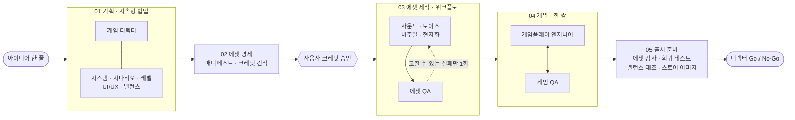

<div align="center">


# VARCO Game Studio

**VARCO API 플랫폼으로 게임을 기획부터 QA까지 만드는 Claude Code 하네스**


[▶ 쇼릴 전체 영상 (1분, MP4)](VARCO-Game-Studio-Showreel.mp4) ·
[🎬 제작 과정 영상 (2분, MP4)](VARCO-Game-Studio-Process.mp4) ·
[📘 레퍼런스 매뉴얼 PDF 내려받기](https://github.com/revfactory/varco-platform/raw/main/VARCO-API-Reference-Manual-ko.pdf) ·
[🚀 하네스 사용법](#사용법)

</div>

---

## 목차

- [이 저장소에 있는 것](#이-저장소에-있는-것)
- [VARCO API 플랫폼 소개](#varco-api-플랫폼-소개)
- [레퍼런스 매뉴얼 내려받기](#레퍼런스-매뉴얼-내려받기)
- [VARCO Game Studio 하네스](#varco-game-studio-하네스)
- [사용법](#사용법)
- [알아 두실 점](#알아-두실-점)
- [쇼릴 제작기](#쇼릴-제작기)
- [저장소 구조](#저장소-구조)
- [권리 안내](#권리-안내)

## 이 저장소에 있는 것

| 항목 | 위치 | 설명 |
| --- | --- | --- |
| 게임 제작 하네스 | `.claude/agents/`, `.claude/skills/` | Claude Code 에이전트 15명과 스킬 17개. 게임 아이디어 한 줄로 기획, 에셋 제작, 프로토타입 개발, QA, 출시 판정까지 진행합니다 |
| VARCO 레퍼런스 매뉴얼 | [`VARCO-API-Reference-Manual-ko.pdf`](VARCO-API-Reference-Manual-ko.pdf) | api.varco.ai 공개 문서를 모은 한국어 PDF, 141쪽 |
| VARCO 플랫폼 소개 영상 | [`VARCO-Platform-Intro.mp4`](VARCO-Platform-Intro.mp4) | VARCO API 서비스를 소개하는 47초 모션그래픽 |
| 하네스 쇼릴 | [`VARCO-Game-Studio-Showreel.mp4`](VARCO-Game-Studio-Showreel.mp4) | 하네스로 게임이 만들어지는 과정을 담은 1분 모션그래픽, 사운드트랙 포함 |
| 제작 과정 영상 | [`VARCO-Game-Studio-Process.mp4`](VARCO-Game-Studio-Process.mp4) | 코인 러너가 준비부터 출시 판정까지 가는 과정을 해설 자막과 함께 따라가는 2분 모션그래픽, 사운드트랙 포함 |

## VARCO API 플랫폼 소개


[VARCO API 플랫폼](https://api.varco.ai/ko)은 NC AI가 운영하는 AI API 서비스입니다. 한 번 연동하면 텍스트, 이미지, 오디오, 3D를 다루는 AI 기능을 같은 방식으로 호출할 수 있고, 호출 내역과 크레딧 사용량은 워크스페이스에서 함께 관리합니다.

### 제공 서비스

| 분류 | 서비스 | 할 수 있는 일 |
| --- | --- | --- |
| Game AI | **Sound** | 텍스트로 효과음·환경음 생성(Text to Sound), 변형(Variation), 끊김 없는 루프(Looping), 모노→스테레오, 사람 목소리를 몬스터 음색으로 변환(Conversion), 잡음 제거(Enhance) |
| Game AI | **3D** | 이미지 한 장으로 3D 메시와 텍스처 생성(Image to 3D, GLB) |
| Game AI | **SyncFace** | 음성으로 입 모양·표정 블렌드셰이프 애니메이션 생성(Voice-to-Face) |
| Media AI | **Voice** | 빠른 TTS(Lite), 감정 연기 TTS(Standard), 목소리만 바꾸는 음성 변환(Voice Conversion, Acting) |
| Media AI | **Translate** | 용어집을 반영한 게임 채팅·콘텐츠 번역(10개 언어) |
| Visual AI | **Art Fashion** | 배경 합성, 시점 변경, 업스케일, 지우기, 인페인트, 텍스처·그래픽 합성, 가상 착장, 헤드스왑 |
| Content Biz AI | **Chatbot** | FAQ·RAG 기반 상담 챗봇과 지식 관리 도구 |
| Content Protection AI | **Gentle Words** | 채팅·게시글의 스팸과 금칙어 필터링 |
| Integrations | **플러그인** | VARCO Sound Unity 플러그인(효과음·루프·크리처·음악·음성을 에디터 안에서 생성) |

### 시작하는 순서

1. [api.varco.ai](https://api.varco.ai/ko)에 구글 계정으로 가입합니다. 가입하면 개인 워크스페이스가 만들어집니다.
2. 여럿이 함께 쓰려면 공용 워크스페이스를 만들고 멤버를 초대합니다.
3. 사이드바의 **API 키** 메뉴에서 키를 발급합니다.
4. 워크스페이스 오너가 **크레딧**을 구매합니다. 호출마다 크레딧이 차감됩니다.
5. 요청 헤더에 `OPENAPI_KEY`를 넣어 호출합니다.

```bash
curl https://openapi.ai.nc.com/sound/varco/v1/api/text2sound \
  -H "OPENAPI_KEY: $OPENAPI_KEY" \
  -H "Content-Type: application/json" \
  -d '{"prompt": "비 내리는 숲속 환경음", "num_sample": 2}'
```

> [!NOTE]
> 과금은 사용량 기반 크레딧 방식입니다. 공식 가격표는 2026년 9월 기준 "공개 예정"입니다. API 키는 코드나 문서에 적지 말고, 유출이 의심되면 바로 폐기한 뒤 새로 발급하십시오.

## 레퍼런스 매뉴얼 내려받기

<table>
<tr>
<td width="300"></td>
<td>

**VARCO API Platform 레퍼런스 매뉴얼 (한국어판)**

- 141쪽, 2026년 9월 28일 기준
- **제1부 도큐먼트 25편:** 시작하기, Game AI, Media AI, Visual AI, Content Biz AI, Content Protection AI, Integrations
- **제2부 API 레퍼런스 28편:** 엔드포인트, 요청 파라미터, 응답 형식, 예제 코드
- 이미지 77장과 오디오 샘플 16개를 함께 실었습니다

[📥 PDF 내려받기 (11MB)](https://github.com/revfactory/varco-platform/raw/main/VARCO-API-Reference-Manual-ko.pdf) · [GitHub에서 보기](VARCO-API-Reference-Manual-ko.pdf)

</td>
</tr>
</table>

> [!IMPORTANT]
> 이 매뉴얼은 [api.varco.ai](https://api.varco.ai/ko)에 공개된 문서를 모아 엮은 참고용 사본이며, NC AI가 발행한 공식 문서가 아닙니다. 엔드포인트와 파라미터의 최신 명세는 공식 API Reference 페이지에서 확인하십시오.

## VARCO Game Studio 하네스

게임 아이디어 한 줄을 받으면 Claude Code의 에이전트 15명이 다섯 단계로 게임을 만듭니다. 기획 문서, VARCO로 만든 효과음·대사 음성·얼굴 애니메이션·3D 모델·번역 문자열, 플레이할 수 있는 웹 또는 Unity 프로토타입, QA 보고서, 출시 판정서가 결과물로 나옵니다.

[](VARCO-Game-Studio-Process.mp4)

<sub>▶ 이미지를 누르면 2분 제작 과정 영상(MP4)이 열립니다. 준비부터 출시 판정까지 단계마다 누가 무엇을 하는지 자막으로 설명합니다.</sub>

### 진행 흐름



단계마다 작업 성격이 달라 실행 방식을 다르게 골랐습니다.

| 단계 | 실행 방식 | 고른 이유 |
| --- | --- | --- |
| 01 기획 | 이름 붙인 에이전트들이 메시지를 주고받는 지속형 협업 | 시스템·시나리오·레벨·UI 문서가 서로 맞물려 여러 번 조율해야 합니다 |
| 02 에셋 명세 | 서브에이전트 한 명 + **사용자 승인** | 매니페스트 한 벌이면 충분하고, 돈이 드는 단계라 사람이 승인해야 합니다 |
| 03 에셋 제작 | Workflow 스크립트 | 만들 에셋 목록과 검증·재작업 규칙을 코드로 정할 수 있습니다 |
| 04 개발 | 엔지니어와 QA 한 쌍 | 모듈을 끝낼 때마다 바로 검사하고 버그를 주고받습니다 |
| 05 출시 준비 | 검사 네 가지를 병렬로 돌린 뒤 디렉터가 판정 | 서로 독립인 검사를 동시에 돌리고, 판정은 한 사람이 기준표로 내립니다 |

### 단계별 모습

<table>
<tr>
<td width="50%"><br><b>팀</b> · 게임 디렉터를 중심으로 다섯 단계 에이전트 15명</td>
<td width="50%"><br><b>01 기획</b> · 밸런스 분석가와 시스템 기획자가 수치를 조율하고, 디렉터가 불일치를 해결한 뒤 동결</td>
</tr>
<tr>
<td><br><b>02 명세</b> · 에셋 매니페스트와 크레딧 견적, 사용자 승인</td>
<td><br><b>03 제작</b> · 효과음, 대사 음성과 립싱크, 3D 모델, 번역을 병렬로 만들고 에셋마다 QA</td>
</tr>
<tr>
<td><br><b>04 개발</b> · 에셋을 불러와 실행하고, QA가 버그를 잡으면 엔지니어가 고친 뒤 재검사</td>
<td><br><b>05 출시</b> · 기준 여섯 가지를 모두 통과하면 GO</td>
</tr>
</table>

### 팀 구성

모델은 에이전트의 위상이 아니라 업무 성격으로 골랐습니다. 막연한 아이디어를 구체화하고 전체를 통합하는 일에는 fable, 설계·코드·교차 검증에는 opus, 절차가 정해진 제작과 검사에는 sonnet을 씁니다.

| 단계 | 에이전트 | 모델 | 하는 일 |
| --- | --- | --- | --- |
| 기획 | `game-director` | fable | 컨셉 구체화, 기획 문서 통합 리뷰, GDD, 출시 판정 |
| 기획 | `systems-designer` | opus | 코어 루프·시스템 규칙, 밸런스 CSV와 스키마 |
| 기획 | `narrative-designer` | opus | 세계관, 캐릭터, 대사 스크립트, 용어집 |
| 기획 | `level-designer` | opus | 레벨 배치와 난이도 흐름, 사운드 구역, 필요한 프랍 |
| 기획 | `ux-designer` | sonnet | 화면 흐름, HUD, UI 문자열 |
| 기획·출시 | `balance-analyst` | opus | 몬테카를로 시뮬레이션으로 수치 검증, 구현 수치 대조 |
| 명세 | `asset-producer` | sonnet | 에셋 매니페스트, VARCO API 호출 순서, 크레딧 견적 |
| 제작 | `sound-designer` | sonnet | 효과음, 환경음 루프, 크리처 음성 |
| 제작 | `voice-director` | sonnet | 화자 캐스팅, 대사 음성, 얼굴 애니메이션 |
| 제작 | `visual-artist` | sonnet | 3D 모델, 이미지 편집 |
| 제작 | `localization-specialist` | sonnet | 대사·UI 번역, 용어집·자리표시자 보호 |
| 제작·출시 | `asset-qa` | sonnet | 에셋 측정·검증, 출시 전 전수 감사 |
| 개발 | `gameplay-engineer` | opus | 웹(Phaser 3·three.js) 또는 Unity 6 프로토타입 |
| 개발·출시 | `game-qa` | opus | 테스트 계획, 모듈별 검사, 버그 리포트, 회귀 테스트 |
| 출시 | `marketing-artist` | sonnet | 스토어 키 아트·캡슐 이미지, 스토어 설명 |

### 스킬

| 묶음 | 스킬 |
| --- | --- |
| 조율 | `varco-game-studio`: 전체 흐름을 조율하는 오케스트레이터 |
| 공용 | `varco-api`: VARCO API 명세 정리본과 공용 클라이언트 `varco_client.py` |
| 기획 | `game-concept`, `game-systems-design`, `game-narrative`, `level-design`, `game-ux-design`, `balance-simulation` |
| 제작 | `asset-manifest`, `varco-sound-production`, `varco-voice-production`, `varco-visual-production`, `varco-localization`, `marketing-kit` |
| 개발·QA | `game-prototype-dev`, `asset-qa-check`, `game-qa-testing` |

에이전트끼리 주고받는 파일의 위치와 형식은 [산출물 계약서](.claude/skills/varco-game-studio/references/contracts.md) 한 곳에서 정합니다.

### 크레딧을 지키는 장치

- **크레딧 승인:** 에셋을 만들기 전에 견적을 보여 주고 반드시 사용자 승인을 받습니다.
- **예산 차단:** 모든 VARCO 호출은 공용 클라이언트를 거칩니다. 승인한 예산을 넘는 호출은 보내지 않고, 여러 에이전트가 동시에 호출해도 잠금으로 크레딧을 먼저 예약하므로 예산을 넘지 않습니다.
- **호출 장부:** 모든 호출(드라이런 포함)이 `varco_ledger.jsonl`에 한 줄씩 남습니다.
- **드라이런:** 키가 없거나 원하지 않으면 실제로 호출하지 않고 요청 명세와 견적만 만듭니다.
- **즉시 중단:** 인증 실패나 크레딧 부족이 한 번이라도 나오면 아직 시작하지 않은 에셋은 호출하지 않습니다.
- **단가 미공개 API:** 번역, Voice-to-Face, 음성 변환 Acting은 단가가 공개되지 않아 따로 승인받아야 호출합니다. 승인하지 않으면 연기 변환은 일반 TTS로 대체하고 얼굴 애니메이션은 뺍니다.

## 사용법

### 준비물

| 필요한 것 | 용도 |
| --- | --- |
| [Claude Code](https://code.claude.com/docs) | 하네스 실행 |
| Python 3 (3.10 이상 권장), `numpy`, `Pillow`, `requests` | 공용 클라이언트와 검사 스크립트 |
| `ffmpeg`, `ffprobe` | 오디오 후처리와 측정 |
| VARCO `OPENAPI_KEY` (선택) | 실제 에셋 생성. 없으면 드라이런으로 진행합니다 |
| Unity 6 (선택) | Unity 프로토타입. 기본값은 웹입니다 |
| Playwright MCP (선택) | 웹 프로토타입을 브라우저로 직접 플레이하며 QA |

### 설치

```bash
git clone https://github.com/revfactory/varco-platform.git
cd varco-platform
pip install numpy pillow requests

# 선택: VARCO 키. .env 는 .gitignore 에 들어 있어 커밋되지 않습니다
echo "OPENAPI_KEY=발급받은_키" > .env

claude
```

> [!TIP]
> 하네스 파일을 방금 추가했거나 수정한 세션에서는 에이전트가 아직 등록되지 않았을 수 있습니다. Claude Code를 새로 시작하면 `.claude/agents/`의 에이전트 15명을 불러옵니다.

### 게임 만들기

Claude Code에 만들고 싶은 게임을 말하면 `varco-game-studio` 스킬이 불립니다.

```text
무너지는 금고에서 코인을 모아 탈출하는 2분짜리 웹게임 만들어줘
```

```text
Unity로 VARCO 사운드가 들어간 탑다운 슈터 프로토타입 만들어줘. 번역은 영어와 일본어.
```

진행하는 동안 두 번 멈춰서 묻습니다.

1. **컨셉 승인:** 디렉터가 쓴 컨셉의 핵심 결정 세 가지를 보여 주고 방향을 확인합니다.
2. **크레딧 승인:** 에셋 목록과 견적(우선순위별 합계, 단가 미공개 호출 수, 수동 제작 에셋)을 보여 주고 전체 승인, P0만 승인, 드라이런 가운데 고르게 합니다.

결과는 두 폴더에 나뉘어 쌓입니다.

```text
games/{slug}/               확정본: 다음 단계와 사람이 보는 결과
├── docs/                   컨셉, GDD, 시스템, 시나리오, 레벨, UX, 밸런스 보고서
├── data/                   밸런스 CSV, 캐릭터·대사·UI 문자열, 용어집, strings/{lang}.json
├── assets/                 효과음, 환경음, 대사 음성, 얼굴 애니메이션, 3D 모델, 이미지
├── manifest.json           승인된 에셋 목록과 제작 상태
├── web/ 또는 unity/        프로토타입
├── qa/                     테스트 계획, 버그 리포트, 보고서, 스크린샷
├── marketing/              스토어 이미지
└── RELEASE_REPORT.md       출시 판정서

_workspace/{slug}/          작업 기록: 초안, 에이전트 간 산출물, 크레딧 장부, 동결 해시
```

### 이어서 요청하기

이미 진행한 게임은 필요한 부분만 다시 돌립니다.

| 이렇게 요청하면 | 다시 돌리는 범위 |
| --- | --- |
| "밸런스 수정해줘, 적이 너무 세" | 시스템 기획·밸런스 분석 → 데이터 재반영 → 구현 수치 대조 |
| "대사 음성만 다시 뽑아줘" | 3단계를 해당 에셋만 |
| "일본어 현지화 추가해줘" | 에셋 명세에 현지화 추가 → 크레딧 승인 → 3단계 |
| "드라이런 말고 실제로 생성해줘" | 키 확인 → 크레딧 승인 → 3단계 전체 |
| "버그 고쳐줘", "QA 다시 돌려줘" | 4단계 엔지니어·QA 한 쌍 |
| "스토어 이미지 다시 만들어줘" | 마케팅 아티스트만 |
| "출시 판정 다시" | 5단계 |

### VARCO API만 직접 쓰기

게임 전체가 아니라 VARCO API 한두 번만 필요하면 공용 클라이언트를 바로 써도 됩니다.

```bash
C=.claude/skills/varco-api/scripts/varco_client.py

# 사용할 수 있는 API 목록과 추정 단가
python3 $C catalog

# 호출 전 파라미터 검사(필수값, 허용값, 글자·바이트 한도)와 추정 크레딧
python3 $C validate sound.text2sound --param prompt="heavy door creaking" --param num_sample=3

# 드라이런: 호출하지 않고 요청 명세만 저장
python3 $C call sound.text2sound --param prompt="coin pickup chime" \
  --out out/coin.wav --ledger out/ledger.jsonl --dry-run

# 실제 호출: 장부 기준 누적 500 크레딧을 넘으면 호출하지 않음
python3 $C call sound.variation --file source=out/coin_01.wav --param num_sample=4 \
  --out out/coin_var.wav --ledger out/ledger.jsonl --budget 500

# 장부 요약
python3 $C ledger --ledger out/ledger.jsonl
```

## 알아 두실 점

- **크레딧 단가는 추정치입니다.** 공식 가격표가 공개되지 않아, 각 문서에 주석으로 숨겨진 가격표에서 단가를 가져왔습니다. 번역, Voice-to-Face, 음성 변환 Acting은 단가를 몰라 견적 합계에 들어가지 않습니다.
- **VARCO에 없는 기능이 있습니다.** 텍스트로 이미지를 만드는 API와 음악을 만드는 REST API가 없습니다. 3D 원본 이미지는 사용자가 주거나 다른 이미지 생성 도구로 만들고, 배경음악은 Unity 플러그인에서 사람이 만드는 수동 에셋으로 분류합니다.
- **실제 VARCO 서버로 전체 흐름을 돌려 보지는 않았습니다.** 공용 클라이언트는 로컬 모의 서버로 실제 호출 경로(응답 저장, 3D 결과 조회, 오류 분류, 동시 호출 예산)를 검증했고, 에이전트는 드라이런으로 시험했습니다. 처음 실제 키로 실행할 때 결과를 함께 확인하십시오.
- **Unity WebGL 빌드**가 필요하면 Unity Hub에서 WebGL 빌드 모듈을 설치해야 합니다.

## 쇼릴 제작기

맨 위 영상은 이 하네스가 게임을 만드는 과정을 1분으로 옮긴 모션그래픽입니다. 소재는 하네스를 시험할 때 실제로 만든 "코인 러너"의 대사와 데이터입니다.

- **사양:** 1920×1080, 60fps, 60초, 48kHz 스테레오
- **화면:** HTML 캔버스 한 장에 모든 요소를 코드로 그렸습니다. 모든 장면이 시간만 받아 그리는 순수 함수라 어느 프레임이든 똑같이 다시 그릴 수 있고, 엔딩 몽타주는 앞 장면을 그대로 다시 불러 씁니다.
- **소리:** 120 BPM, A 단조의 음악과 효과음 27종을 numpy로 합성했습니다. 화면과 소리가 같은 큐 시트(`timeline.json`)를 읽어 한 박자 안에서 맞물립니다.

다시 렌더링하려면 Playwright(Python)와 Chrome이 필요합니다.

```bash
cd _workspace/showreel
python3 build_timeline.py          # 큐 시트
python3 audio/synth.py             # 사운드트랙
python3 render.py video out/showreel.mp4 60 audio/soundtrack.wav
```

### 2분 제작 과정 영상

[`VARCO-Game-Studio-Process.mp4`](VARCO-Game-Studio-Process.mp4)는 같은 엔진으로 만든 2분짜리 해설판입니다. 1분 쇼릴이 다섯 단계를 빠르게 훑는다면, 이 영상은 단계 안에서 일이 넘어가는 순서를 따라갑니다. 화면 아래 자막 30줄이 장면마다 누가 무엇을 하는지 설명합니다.

- **사양:** 1920×1080, 60fps, 120초, 48kHz 스테레오
- **쇼릴보다 자세히 보여 주는 장면:** 리더가 실행 설정(`run_meta.json`)을 정하는 준비 단계, 사람에게 묻는 두 번의 확인(컨셉 승인, 크레딧 승인), 공유 작업 목록과 기획 동결·승격, 매니페스트 검사 스크립트, 에셋 QA의 재작업, 엔지니어와 QA의 계획 문서, 결과 폴더와 후속 요청
- **소리:** 쇼릴의 합성기를 고쳐 장면마다 악기 편성을 `timeline.json`에서 읽게 했습니다. 장면 길이를 바꾸고 다시 실행하면 음악과 효과음이 새 시간표를 따라갑니다.

```bash
cd _workspace/process
python3 build_timeline.py          # 큐 시트(장면, 자막, 효과음 시각)
python3 audio/synth.py             # 사운드트랙
python3 render.py video out/process.mp4 60 audio/soundtrack.wav 10   # 브라우저 10개로 나눠 렌더링
```

## 저장소 구조

```text
.
├── .claude/
│   ├── agents/                    에이전트 정의 15개
│   └── skills/                    스킬 17개(스크립트·참조 문서 포함)
├── CLAUDE.md                      하네스 호출 조건과 변경 이력
├── docs/media/                    README 용 GIF와 이미지
├── VARCO-API-Reference-Manual-ko.pdf
├── VARCO-Platform-Intro.mp4       (+ 포스터 이미지)
├── VARCO-Game-Studio-Showreel.mp4 (+ 포스터 이미지)
├── VARCO-Game-Studio-Process.mp4  (+ 포스터 이미지)
└── _workspace/
    ├── link-check/                VARCO 문서 수집 작업 파일
    ├── book/                      레퍼런스 매뉴얼 제작 파일
    ├── animation/                 플랫폼 소개 영상 제작 파일
    ├── showreel/                  하네스 쇼릴 제작 파일
    ├── process/                   2분 제작 과정 영상 제작 파일
    ├── harness-build/             하네스 시험 표본과 검증 스크립트
    └── readme-media/              README GIF 생성 스크립트
```

## 권리 안내

- VARCO와 VARCO API Platform은 NC AI의 서비스입니다. 이 저장소는 NC AI가 운영하는 공식 저장소가 아닙니다.
- 레퍼런스 매뉴얼과 `.claude/skills/varco-api/references/`, `_workspace/link-check/`의 문서 원문 저작권은 NC AI에 있습니다.
- 영상과 매뉴얼에 쓴 Pretendard 글꼴은 SIL Open Font License를 따릅니다.
